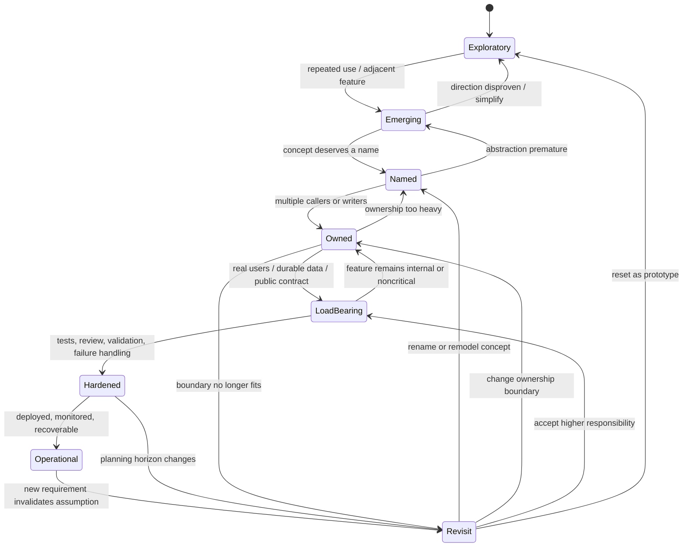

# Architecture Coach Plugin Spec v1

## Status

This is the first product and architecture specification for the technical
architecture coach. It captures the current decisions from the workshop and
follow-up discussion. It prioritizes Claude Code as the first host while keeping
the core model portable across agentic coding environments.

The foundational debate is recorded in
[Moot: The Technical Architecture Coach](./debates/foundations/architecture-coach-moot.md).
This spec turns that debate into a concrete product shape, lifecycle model,
component architecture, roadmap, and evaluation plan.

## Product Thesis

Agentic software development needs an architecture coach that detects when a
codebase is crossing from exploratory implementation into load-bearing
structure, then recommends the smallest entropy-reducing action appropriate to
that moment.

The coach must not be an upfront architecture bureaucracy. It must not simply
ask the host agent to remember to call a strategist. It must be active at the
right lifecycle points, evidence-based in its recommendations, and explicit
about both:

```text
Add this much structure now.
Do not add this larger structure yet.
```

The target outcome is architectural timing:

```text
The system introduces the right structure when complexity, irreversibility,
solution visibility, and planning horizon justify it.
```

## Primary User Experience

The intended experience is:

1. The user asks an agent to create a thing.
2. The agent builds directly while the work is still exploratory.
3. The user asks for adjacent features.
4. The architecture coach observes the request, implementation changes, and
   history.
5. When a threshold is crossed, the coach gives a concise signpost or gate:

```text
Architecture signpost: project persistence is becoming load-bearing.

Keep localStorage for now, but move project persistence behind a
ProjectRepository boundary and define Project as a type before adding more
project features. Do not introduce server persistence unless sharing or sync is
confirmed.
```

The user should experience the coach as timely judgment, not constant planning.

## Core Design Decisions

### 1. Use A Plugin, Not Only A Skill

The richest integration is a plugin that can package multiple components:

```text
skill + hooks + MCP server + CLI/bin + agents + settings + optional monitors
```

A skill alone is portable and useful, but too passive. It relies on the model
choosing to invoke it at the moment when the model may be least likely to
notice rising architectural risk.

### 2. Prioritize Claude Code

Claude Code is the primary target for v1 because its plugin surface supports
the components needed for active coaching:

- skills
- command-style skill files
- agents/subagents
- hooks
- MCP servers
- LSP server configuration
- background monitors
- `bin/` executables added to the Bash tool path while the plugin is enabled
- default `settings.json`
- install-time `userConfig`
- output styles and themes
- channel declarations
- dependency declarations
- plugin manifest and distribution metadata

The v1 design should use these capabilities where they materially improve the
coach, while keeping the portable kernel independent of Claude-specific
configuration.

### Claude Code Component Inventory

The architecture-coach plugin should treat Claude Code's plugin system as a
rich packaging surface. Each component has a different role and portability
profile.

| Component | v1 Role | Portability |
| --- | --- | --- |
| `.claude-plugin/plugin.json` | Manifest, metadata, component paths, dependencies, user configuration | Claude-specific |
| `skills/` | Portable method and agent-facing workflow guidance | High |
| `commands/` | Legacy/flat command-style skill files; avoid for new core behavior unless needed for convenience | Medium |
| `agents/` | Optional specialist reviewers for high-risk concerns | Medium |
| `hooks/` | Lifecycle capture and enforcement | Host-specific |
| `.mcp.json` or manifest MCP config | Connect the architecture-coach MCP server | High at protocol level, host-specific in config |
| `.lsp.json` or manifest LSP config | Optional code intelligence signal source | Claude-specific |
| `monitors/monitors.json` | Optional background runtime/deployment signal source | Claude-specific |
| `bin/` | Deterministic `archcoach` CLI available to Bash while plugin is enabled | High |
| `settings.json` | Conservative default Claude behavior when plugin is enabled | Claude-specific |
| `userConfig` | Install-time options and sensitive values for endpoints/tokens/mode | Claude-specific |
| `output-styles/` | Optional response presentation styles; not core policy | Low |
| `themes/` | Optional visual customization; not core policy | Low |
| `channels` | Optional external message injection surface | Low to medium |
| `dependencies` | Declare plugin dependencies and version constraints | Claude-specific |

`bin/` and `userConfig` are especially important. `bin/` lets the plugin ship
the deterministic `archcoach` executable that skills, hooks, humans, and CI can
invoke. `userConfig` lets the plugin collect mode, storage, endpoint, and token
configuration at enable time rather than requiring manual settings edits.

### 3. Define A Portable Kernel

The product center is not a Claude hook. The product center is an
Architecture Coach Kernel.

The kernel owns:

```text
event schema
repo signal bundle schema
maturity state machine
architecture memory format
decision record format
intervention policy
action vocabulary
recommendation formatting
evaluation fixtures
```

Claude Code hooks, Codex plugins, Gemini extensions, CI jobs, and command-line
wrappers should all be adapters around the same kernel.

### 4. Use Hooks For Lifecycle Capture, Not Dumb Keyword Rules

Hooks should be deterministic about when the coach is consulted. They should
not reduce architectural judgment to keyword matching.

The wrong design is:

```text
if prompt contains "share" then warn about collaboration
```

The right design is:

```text
hook captures lifecycle event
hook packages context bundle
kernel or MCP evaluator classifies architectural significance
coach returns silent / note / recommend / block
host injects, logs, prompts, or gates accordingly
```

Simple lexical hints may be used as cheap routing signals, but never as the
source of architectural conclusions.

### 5. Separate Signal Capture From Action

Signal capture is observability. Action is entropy management.

The coach is valuable only when it converts messy progress signals into a
specific movement:

```text
Continue
Localize
Name
Extract
Assign ownership
Insert boundary
Record decision
Add test harness
Run review
Split module
Replace substrate
Operationalize
Stop and decide
```

### 6. Model Maturity Per Concern

The whole repository does not have one maturity level. Each architectural
concern has its own state.

Examples:

- React state ownership
- project persistence
- authentication
- authorization
- deployment
- API contracts
- background jobs
- search
- billing
- observability

A system can have mature deployment and exploratory search, or hardened
authentication and immature data export. The coach must reason per concern.

## System Components

### Architecture Coach Kernel

The kernel is a host-neutral executable/library. It should be callable from:

- a CLI in `bin/`
- an MCP server
- host-specific hooks
- CI or pre-commit jobs
- test fixtures

Responsibilities:

- normalize lifecycle events into a standard event envelope
- extract signals from request, diff, repo, tests, and memory
- classify concern maturity
- detect threshold crossings
- choose an intervention level
- choose an entropy-reducing action
- update or query architecture memory
- format recommendations for host agents and users

The kernel may use deterministic rules, static analysis, and model-based
evaluation. Deterministic checks should handle evidence collection and schema
validation. Semantic judgment should be model-assisted.

### CLI

The plugin should ship a deterministic CLI called `archcoach`.

Representative commands:

```text
archcoach assess-request
archcoach assess-change
archcoach plan-interview
archcoach apply-interview-answers
archcoach review-structure
archcoach record-decision
archcoach check-revisit
archcoach scan-repository
archcoach summarize-diff
archcoach state
archcoach test-fixture
```

The CLI is useful because it:

- works outside a specific host
- can be invoked by skills, hooks, CI, and humans
- makes evaluation reproducible
- provides a fallback when MCP is unavailable

### MCP Server

The MCP server exposes the kernel to coding agents as tools.

Minimum v1 tools:

```text
architecture.assess_change
architecture.plan_interview
architecture.apply_interview_answers
architecture.horizon_scan
architecture.review_structure
architecture.record_decision
architecture.check_revisit_triggers
architecture.get_memory
architecture.scan_repository
```

The MCP layer should preserve determinism where possible and return structured
results. The tool descriptions should carry the control-surface contract:
agents should understand when the tool is expected, what inputs matter, and how
to act on the returned intervention.

Interviewing is host-mediated. The coach selects and prioritizes questions,
provides answer schemas/options, and applies structured answers to baseline
state or memory. The coding host owns the human conversation: it asks questions
in natural language, handles clarification, and sends structured answers back
through MCP or CLI. The coach must not invent user answers and should not try to
be a chat interface.

### Skill

The skill teaches the agent how to work with the coach.

It should include:

- the maturity model
- the four decision axes
- the intervention levels
- the action vocabulary
- guidance for user-facing explanations
- guardrails against overengineering
- instructions for when to call MCP tools voluntarily
- instructions for how to respond to hook-injected recommendations
- instructions for host-mediated interviews: ask the user naturally, explain
  why a question matters, do not invent answers, and call
  `architecture.apply_interview_answers` with structured answers

The skill should not be the only enforcement mechanism.

### Hooks

Hooks provide lifecycle capture and enforcement in Claude Code.

Recommended Claude Code hook events:

```text
SessionStart
UserPromptSubmit
PostToolBatch
PostToolUse
Stop
ConfigChange
FileChanged
```

The first v1 integration should focus on:

```text
SessionStart
UserPromptSubmit
PostToolBatch
Stop
```

Hook responsibilities:

- capture event context
- call `archcoach` or the MCP tool
- inject context or recommendation
- surface `interview_required` or `decision_required` for the host agent to
  handle conversationally
- block only when the intervention level requires it
- avoid infinite loops on Stop hooks
- write compact audit records

Hooks should be thin adapters. They should not contain the core architecture
policy and should not conduct interviews themselves.

### Agents / Subagents

Specialist agents are optional but useful for deeper reviews.

Candidate agents:

```text
architecture-reviewer
security-reviewer
persistence-reviewer
deployment-reviewer
api-contract-reviewer
```

Subagents should be used when the coach identifies a high-risk concern that
requires deeper judgment than a short signpost can provide.

### LSP Servers

Claude Code plugins can provide LSP server configuration. This is not required
for the first kernel, but it is useful for improving repo signal quality.

Potential uses:

- richer symbol ownership detection
- reference counting for emerging concepts
- import graph analysis
- API surface detection
- diagnostics after edits

LSP should be treated as signal enhancement, not as a prerequisite.

### Background Monitors

Claude Code plugin monitors can stream background events into the session while
the plugin is active. They are useful for runtime and operational signals.

Potential uses:

- watch test logs
- watch dev server errors
- watch deployment status
- watch local app error logs
- watch generated architecture memory changes

Monitors should be optional because they are host-specific and may not be
available in all execution contexts.

### Default Settings

Claude plugin `settings.json` can provide defaults when the plugin is enabled.
Use settings conservatively.

Potential defaults:

- activate a custom architecture-aware agent only in explicit modes
- configure status-line visibility for architecture alerts
- enable minimal hook set

The plugin should not surprise users by globally changing agent behavior beyond
the enabled architecture-coach scope.

### User Configuration

Claude plugin `userConfig` should be used for install-time configuration.

Candidate options:

```text
coach_mode
  advisory | balanced | strict

memory_location
  project | user | external

model_provider
  host | configured_api | local

external_api_endpoint
  optional endpoint for hosted evaluator

external_api_token
  sensitive token if external evaluator is used

block_on_security_threshold
  boolean

block_on_unrecorded_decision
  boolean
```

Sensitive values must be handled through the host's secure configuration
mechanism where available. Claude plugin subprocesses should consume configured
values through the host-provided substitution and environment mechanisms rather
than reading hand-maintained dotfiles.

## Claude Code Plugin Shape

Recommended repository layout:

```text
architecture-coach/
  .claude-plugin/
    plugin.json

  skills/
    architecture-coach/
      SKILL.md

  commands/
    architecture-status.md

  agents/
    architecture-reviewer.md
    security-reviewer.md
    persistence-reviewer.md
    deployment-reviewer.md

  hooks/
    hooks.json
    session-start.sh
    user-prompt-submit.sh
    post-tool-batch.sh
    stop.sh

  bin/
    archcoach

  mcp/
    server

  monitors/
    monitors.json

  output-styles/
    architecture-signpost.md

  themes/

  protocol/
    event.schema.json
    assessment.schema.json
    decision.schema.json
    memory.schema.json

  fixtures/
    cases/

  docs/
    README.md
    evaluation.md
```

The `bin/archcoach` CLI and MCP server should share the same kernel. Hooks
should call the CLI or MCP endpoint rather than duplicating logic.

## Interoperability Strategy

The portability hierarchy is:

```text
Most portable:
  written method, schemas, SKILL.md-style instructions

Portable:
  MCP tools and server
  CLI executable
  JSON fixtures

Host-specific:
  Claude hooks
  Codex hooks
  Gemini extension hooks
  plugin manifests
  monitors
  settings
  userConfig
```

The product should therefore be packaged as:

```text
portable protocol + kernel
portable skill/instructions
portable MCP server
portable CLI
thin host adapters
```

Claude Code is the first-class adapter, not the only architecture.

## Lifecycle Model

### Concern State Diagram

Each architectural concern moves through its own maturity states.



### State Definitions

```text
Exploratory
  Local, simple, disposable. Optimize for learning.

Emerging
  A pattern is appearing. Watch closely, but do not overreact.

Named
  The concept is real enough to name as a type, hook, module, domain object,
  or workflow.

Owned
  The concept needs a source of truth and a responsible boundary.

LoadBearing
  Other features, users, data, or external systems depend on it.

Hardened
  The concern has tests, validation, failure handling, review, and migration
  care appropriate to its risk.

Operational
  The concern runs in the world with config, secrets, logs, monitoring,
  backups, rollback, deployment, and support expectations.

Revisit
  A prior assumption, shortcut, boundary, or substrate may no longer fit.
```

### Decision Axes

Every assessment should score or classify:

```text
complexity
  How many moving parts does the change involve?

irreversibility
  How expensive is this decision to undo?

solution_visibility
  How clear is the correct structure?

planning_horizon
  How likely is this concern to keep changing?
```

Decision policy:

```text
Low complexity + high solution visibility
  Build directly.

Low complexity + low solution visibility
  Keep simple and isolate assumptions.

High complexity + high solution visibility
  Add structure now.

High complexity + low solution visibility
  Add reversible structure, record assumptions, set revisit triggers.
```

## Signal Model

### Signal Sources

The coach should consume:

```text
current user request
recent user requests
current plan, if available
tool event metadata
changed files
current diff or diff summary
repo tree
import/dependency graph
test status
diagnostics
known architecture decisions
known shortcuts
revisit triggers
deployment/config signals
runtime/log signals when available
```

No single signal should be decisive unless the risk is concrete and high.

### Event Envelope

All host adapters should normalize events into a shared envelope:

```json
{
  "schema_version": "1.0",
  "host": "claude-code",
  "event": "post_tool_batch",
  "session_id": "opaque-session-id",
  "cwd": "/repo",
  "user_request": "Let teammates share projects",
  "recent_requests": [
    "Add saved projects",
    "Add project tags",
    "Add project search"
  ],
  "changed_files": [
    "src/pages/ProjectEditor.tsx",
    "src/lib/projectStorage.ts",
    "src/components/ShareDialog.tsx"
  ],
  "diff_summary": "Adds share UI and stores invited emails in localStorage",
  "test_summary": {
    "status": "not_run"
  },
  "memory_refs": [
    "decision-2026-04-localstorage-projects"
  ]
}
```

### Thresholds

The first trigger taxonomy should include:

```text
repetition threshold
  The same behavior appears in multiple places.

state ownership threshold
  State moves from local UI detail to shared product behavior.

persistence threshold
  Data must survive, migrate, sync, be searched, or be queried.

identity threshold
  Users, sessions, roles, or account ownership appear.

collaboration threshold
  Single-user data becomes shared or permissioned.

public API threshold
  External callers depend on request/response contracts.

deployment threshold
  Local code becomes hosted software for other people.

operational threshold
  Logs, metrics, backups, alerts, or recovery become relevant.

security threshold
  Secrets, auth, permissions, payments, or private data appear.

blast-radius threshold
  A small feature requires broad, unrelated changes.

revisit threshold
  A current request satisfies a prior "revisit if" condition.
```

Thresholds are semantic classifications, not keyword matches.

## Action Model

### Intervention Levels

```text
silent
  No architecture advice should be shown.

note
  Mention a future pressure point without changing the implementation path.

recommend
  Suggest architecture work before or alongside the feature.

block
  Stop or redirect implementation until a decision is made because the risk is
  high or the prior assumption is invalid.
```

Blocking should be rare. Valid blocking candidates:

- real auth or authorization without a security decision
- handling real private data without ownership/access rules
- production migration without rollback or backup plan
- public API contract change without compatibility decision
- payment/billing behavior without review
- deployment exposing known insecure behavior
- unresolved Stop-hook architecture gate in strict mode

### Action Vocabulary

The coach should choose from a finite action set:

```text
Continue
  No structure needed.

Localize
  Keep the implementation contained and reversible.

Name
  Create a first-class concept, type, hook, module, or domain object.

Extract
  Move repeated behavior into a hook, helper, service, or module.

Assign ownership
  Declare source of truth and responsible module.

Insert boundary
  Add a repository, client, service, interface, or adapter around a concern.

Record decision
  Save assumption, rationale, alternatives, and revisit trigger.

Add test harness
  Protect load-bearing behavior before more change lands.

Run review
  Run security, data, deployment, API, or architecture review.

Split module
  Reduce coupling where change is spreading.

Replace substrate
  Move from files/localStorage/mock data to database, service, provider, or
  other more suitable substrate.

Operationalize
  Add config, secrets, logging, health checks, backups, rollback, or deploy
  path.

Stop and decide
  Require a human or explicit agent decision before continuing.
```

### Assessment Output

The standard assessment response should be:

```json
{
  "schema_version": "1.0",
  "intervention": "recommend",
  "confidence": "high",
  "concern": "project persistence",
  "from_state": "Owned",
  "to_state": "LoadBearing",
  "thresholds": ["persistence", "revisit"],
  "action": "Insert boundary",
  "reason": "Project data is now durable and has multiple callers, while storage details are leaking into UI components.",
  "recommendation": "Move project persistence behind ProjectRepository and define Project as a domain type before adding sharing.",
  "do_not_add": "Do not introduce multi-tenant collaboration infrastructure until sharing is confirmed as real rather than mock-only.",
  "requires_user_decision": false,
  "memory_updates": [
    {
      "type": "decision_suggested",
      "title": "Project persistence boundary"
    }
  ]
}
```

## Architecture Memory

### Purpose

Architecture memory exists to prevent old simplifying assumptions from silently
governing new requirements.

### Decision Record Format

```json
{
  "schema_version": "1.0",
  "id": "decision-2026-04-localstorage-projects",
  "concern": "project persistence",
  "decision": "Store draft project data in localStorage",
  "context": "Single-user prototype with no sharing or sync",
  "alternatives": ["SQLite", "server database", "file storage"],
  "reason": "Fastest reversible option for local-only prototype",
  "state": "Owned",
  "risks": ["No multi-device sync", "Weak migration story"],
  "revisit_if": ["sharing", "sync", "large project data", "user accounts"],
  "created_by": "architecture-coach",
  "created_at": "2026-04-30"
}
```

### Storage

The first implementation should support project-local memory.

Recommended location:

```text
.archcoach/
  memory.jsonl
  state.json
  audit.jsonl
```

Project-local storage is transparent and versionable. Later implementations may
support user-global or external storage.

## Claude Code Lifecycle Integration

### SessionStart

Purpose:

- load project architecture memory
- inject concise current context
- restore unresolved signposts after resume or compaction

Action:

```text
archcoach state --format claude-context
```

Expected output:

```text
Architecture Coach Memory:
- Project persistence is Owned. Revisit if sharing, sync, or user accounts appear.
- Auth is Exploratory. Demo-only login must not be used for public deployment.
- Deployment is Exploratory. No production secrets or monitoring configured.
```

### UserPromptSubmit

Purpose:

- assess whether the user's next request may change architecture responsibility
- surface existing revisit triggers before planning

Action:

```text
archcoach assess-request --event-json stdin
```

Allowed responses:

- inject nothing
- inject a note/recommendation
- inject an interview-needed signpost for the host agent to ask the user
- ask the agent to call an MCP tool for deeper assessment
- in strict mode, block planning until an explicit decision is made

This hook should call a semantic evaluator. It must not rely on keyword
matching as the decision mechanism.

### PostToolBatch

Purpose:

- inspect implementation drift after a batch of tool calls
- catch file changes made through shell commands as well as edit tools
- detect diff spread, ownership leakage, and unrecorded decisions

Action:

```text
archcoach assess-change --event-json stdin --include-git-diff
```

Expected behavior:

- if silent, do nothing
- if note/recommend, inject context into the next model turn
- if interview is required, inject structured questions and require the host
  agent to ask the user before fabricating assumptions
- if block, instruct the agent to address the architectural issue before
  continuing

### Stop

Purpose:

- final gate before the agent ends its turn
- prevent unresolved high-risk thresholds from being skipped

Action:

```text
archcoach check-revisit --event-json stdin --before-stop
```

Expected behavior:

- do nothing if no unresolved issue exists
- in advisory mode, append a concise note
- in balanced mode, block only high-risk unresolved issues, including
  unanswered high-risk interview questions
- in strict mode, block unresolved recommend/block issues, including required
  interviews or decisions

The Stop hook must detect when it is already active to avoid infinite
continuation loops.

## Roadmap

This roadmap is ordered by dependency and learning value, not by dates.

### Stage 1: Protocol And Fixtures

Deliver:

- event schema
- assessment schema
- decision record schema
- maturity state machine
- action vocabulary
- fixture format
- initial scenario test corpus

Reason:

The protocol must be stable before multiple host adapters exist.

### Stage 2: Kernel CLI

Deliver:

- `archcoach` CLI
- project-local `.archcoach/` memory
- deterministic diff summary helpers
- semantic evaluator interface
- fixture runner

Reason:

The CLI gives repeatable behavior before host integration complexity.

### Stage 3: MCP Server

Deliver:

- MCP server wrapping the same kernel
- tool contracts for assessment, memory, and revisit checks
- structured JSON outputs
- tool descriptions that encode expected agent behavior

Reason:

MCP is the most portable deterministic integration surface across agentic
coding hosts.

### Stage 4: Claude Code Plugin

Deliver:

- plugin manifest
- architecture-coach skill
- minimal hook set: SessionStart, UserPromptSubmit, PostToolBatch, Stop
- `bin/archcoach`
- optional specialist agents
- userConfig for mode and memory location

Reason:

Claude Code is the priority host and supports the richest plugin surface for
active lifecycle coaching.

### Stage 5: Evaluation Harness

Deliver:

- golden fixtures
- mocked host lifecycle events
- expected intervention assertions
- regression suite for false positives and false negatives
- end-to-end Claude Code plugin smoke tests

Reason:

The coach must be evaluated for timing, not just output quality.

### Stage 6: Portability Adapters

Deliver:

- Codex plugin adapter
- Gemini extension adapter
- generic CI/pre-commit adapter
- skill export/conversion guidance

Reason:

The portable kernel should survive vendor switching even when hook config does
not.

### Stage 7: Advanced Signal Sources

Deliver:

- LSP-enhanced analysis
- optional background monitors
- runtime error/log ingestion
- dependency graph analysis
- architecture drift dashboards

Reason:

These improve signal quality after the basic lifecycle is proven.

## Evaluation And Testing

The coach should be tested at multiple levels. The main evaluation question is
not "does it produce plausible advice?" but:

```text
Does it intervene at the right time with the right entropy-reducing action,
while avoiding premature architecture?
```

### Level 1: Schema And State Machine Tests

Purpose:

- prove events, assessments, decisions, and memory records are valid
- prove state transitions are legal

Test cases:

```text
Valid event envelope parses.
Invalid event missing host fails validation.
Assessment with unknown intervention fails validation.
Decision record with empty revisit_if passes only if explicitly marked final.
Owned -> LoadBearing transition is legal.
Exploratory -> Operational transition requires intermediate explanation.
Revisit can transition back to Exploratory, Named, Owned, or LoadBearing.
```

Acceptance:

- all schemas are machine-validatable
- invalid records fail with actionable error messages
- state transition errors identify the concern and invalid movement

### Level 2: Kernel Fixture Tests

Purpose:

- test semantic classifications and action recommendations independent of host

Fixture structure:

```text
input event bundle
architecture memory
repo summary or diff summary
expected thresholds
expected intervention range
expected action
forbidden action
```

Required fixtures:

1. **Simple first feature**
   - Signal: one-page prototype with local state.
   - Expected: `silent` or `note`.
   - Forbidden: recommending global state framework.

2. **Repeated React state**
   - Signal: second or third page copies filter state and URL serialization.
   - Expected: threshold `repetition` and `state ownership`.
   - Expected action: `Name` or `Extract`.
   - Forbidden: recommending full app-wide state management without evidence.

3. **Persistence appears**
   - Signal: saved projects added via localStorage.
   - Expected: threshold `persistence`.
   - Expected action: `Insert boundary` and `Record decision`.
   - Forbidden: requiring server database unless sharing/sync is present.

4. **Persistence assumption expires**
   - Memory: localStorage decision with revisit_if sharing.
   - Request: teammate sharing.
   - Expected: threshold `revisit` and `collaboration`.
   - Expected action: `Stop and decide` or `Replace substrate`.

5. **Fake auth becomes real**
   - Signal: demo login changed to real account access.
   - Expected: threshold `identity` and `security`.
   - Expected action: `Run review`.
   - In strict mode: `block`.

6. **Deploy to others**
   - Signal: public deployment requested.
   - Expected: threshold `deployment` and possibly `operational`.
   - Expected action: `Operationalize`.
   - Must mention config, secrets, persistence location, logs, rollback, and
     security exposure.

7. **Small request, broad diff**
   - Signal: minor UI request touches UI, API, persistence, config, and tests.
   - Expected: threshold `blast-radius`.
   - Expected action: `Split module` or `Assign ownership`.

8. **Overengineering risk**
   - Signal: first simple feature and agent proposes database, queues, RBAC.
   - Expected: intervention against premature structure.
   - Expected action: `Localize`.
   - Must produce `do_not_add`.

9. **Public API contract**
   - Signal: external endpoint request/response shape changes.
   - Expected: threshold `public API`.
   - Expected action: `Record decision` and `Add test harness`.

10. **Operational log signal**
    - Signal: monitor reports repeated runtime errors after deployment.
    - Expected: threshold `operational`.
    - Expected action: `Harden` or `Operationalize`.

Acceptance:

- required thresholds are detected
- expected action is selected or justified alternative is selected
- forbidden action is not selected
- recommendation includes evidence
- recommendation includes `do_not_add` when overengineering risk exists

### Level 3: MCP Contract Tests

Purpose:

- prove agent-facing tools are stable and useful

Test cases:

```text
architecture.assess_change returns valid assessment JSON.
architecture.plan_interview returns prioritized questions with answer schemas.
architecture.apply_interview_answers applies host-collected answers to baseline state.
architecture.record_decision writes a valid memory record.
architecture.check_revisit_triggers detects expired assumption.
architecture.get_memory returns compact context suitable for injection.
Malformed tool input returns structured error, not prose.
Large diff summary is accepted without exceeding output budget.
```

Acceptance:

- every tool has schema-validated input and output
- every error is structured
- outputs are concise enough for model context
- tool descriptions state when agents should call them

### Level 4: Claude Hook Integration Tests

Purpose:

- prove lifecycle enforcement works without relying on model discretion

Test cases:

1. **Session memory injection**
   - Given `.archcoach/memory.jsonl`
   - When SessionStart fires
   - Then concise architecture memory is injected.

2. **Prompt assessment**
   - Given a request that invalidates a prior revisit trigger
   - When UserPromptSubmit fires
   - Then the agent receives a structured signpost before planning.

3. **Host-mediated interview**
   - Given assessment returns high-impact unresolved questions
   - When UserPromptSubmit or PostToolBatch injects the result
   - Then the host agent asks the user conversationally and submits structured
     answers back to the coach.

4. **PostToolBatch drift detection**
   - Given a diff that stores permissions in localStorage
   - When PostToolBatch fires
   - Then the coach recommends stopping or replacing substrate.

5. **Shell-created file changes**
   - Given files changed via shell command rather than edit tool
   - When PostToolBatch or Stop runs
   - Then changed files are still detected through git status/diff.

6. **Stop gate**
   - Given unresolved high-risk threshold
   - When Stop fires in balanced or strict mode
   - Then finalization is blocked with feedback.

6. **Stop loop prevention**
   - Given Stop hook already active
   - When Stop fires again
   - Then the hook does not create an infinite continuation.

7. **Mode behavior**
   - Advisory mode never blocks.
   - Balanced mode blocks high-risk unresolved issues.
   - Strict mode blocks unaddressed recommendations.

Acceptance:

- hook outputs are valid for Claude Code
- blocking behavior matches mode
- hooks call CLI/MCP rather than duplicating policy
- failures degrade safely with visible diagnostics

### Level 5: Agent Behavior Tests

Purpose:

- prove the host agent acts correctly on coach output

Test cases:

1. **Agent follows Name action**
   - Coach recommends naming an emerging concept.
   - Agent extracts type/hook/module rather than adding unrelated layers.

2. **Agent follows Insert Boundary action**
   - Coach recommends repository boundary.
   - Agent moves storage calls out of UI and adds tests.

3. **Agent respects Do Not Add**
   - Coach says not to add server infrastructure.
   - Agent does not add database/server unless user confirms.

4. **Agent asks for decision when required**
   - Coach returns `requires_user_decision: true`.
   - Agent asks a concrete decision question instead of guessing.

5. **Agent records decision**
   - Coach recommends decision record.
   - Agent writes valid memory with rationale and revisit triggers.

Acceptance:

- agent behavior matches action vocabulary
- user-facing explanation is concise
- no ornamental architecture is added
- memory updates are valid

### Level 6: End-To-End Scenario Tests

Purpose:

- test the full product over multi-turn development arcs

Required scenarios:

1. **Prototype to named state**
   - Turn 1: create dashboard.
   - Turn 2: add filters.
   - Turn 3: add same filters elsewhere.
   - Expected: coach remains quiet early, then recommends extraction.

2. **Local persistence to collaboration**
   - Turn 1: saved projects with localStorage.
   - Turn 2: project search.
   - Turn 3: teammate sharing.
   - Expected: boundary first, then revisit and stop/decision on sharing.

3. **Demo auth to production auth**
   - Turn 1: fake login.
   - Turn 2: deploy demo.
   - Turn 3: real users.
   - Expected: security threshold and managed-auth recommendation or review.

4. **Deployment operationalization**
   - Turn 1: local app.
   - Turn 2: deploy to public URL.
   - Turn 3: add real data.
   - Expected: environment, secrets, persistence, logs, rollback, backup
     signposts.

5. **False positive control**
   - Turn 1: visual copy change.
   - Turn 2: button label change.
   - Turn 3: simple CSS polish.
   - Expected: no architecture signposts.

Acceptance:

- timing is correct across turns
- memory affects future assessments
- intervention level escalates only when evidence escalates
- recommendations remain right-sized

### Level 7: Portability Tests

Purpose:

- prove the kernel survives host changes

Test cases:

```text
Same fixture produces same assessment through CLI and MCP.
Same host-collected interview answer updates baseline state through CLI and MCP.
Claude event adapter and generic event adapter normalize to same envelope.
Skill text can be used without Claude-specific hook assumptions.
Host-specific hook failure does not corrupt memory.
CI adapter can run check-revisit without interactive Claude Code.
```

Acceptance:

- core behavior is host-independent
- Claude plugin is an adapter, not the policy owner
- schemas are stable across hosts

## Success Metrics

The v1 system is successful if:

- it catches threshold crossings that a normal coding agent would likely miss
- it avoids recommending premature structure in simple exploratory work
- it records and later revisits simplifying assumptions
- it produces concise, actionable signposts
- it can block high-risk unresolved issues in Claude Code when configured
- it can run through CLI and MCP without Claude-specific dependencies
- it has regression fixtures for both false negatives and false positives

## Non-Goals

The v1 system should not:

- attempt to design the full architecture upfront
- force all projects into the same architecture pattern
- replace human architectural judgment for high-consequence systems
- depend on keyword matching for semantic decisions
- require cloud services to function locally
- require every host to support Claude-style hooks
- introduce large frameworks when a small boundary or decision record is enough

## Open Questions

These are intentionally not resolved in v1:

```text
Which model provider should power semantic evaluation by default?
How much repo content should be sent to an external evaluator?
Should memory be committed to git by default?
How should teams approve strict-mode blocking policies?
Can architecture decisions be mapped to ADR formats without losing simplicity?
Should the coach provide visual architecture drift reports?
What is the minimum LSP integration that improves signal without adding setup
friction?
```

## Reference Links

- Foundational workshop:
  [docs/debates/foundations/architecture-coach-moot.md](./debates/foundations/architecture-coach-moot.md)
- Claude Code plugins:
  <https://code.claude.com/docs/en/plugins>
- Claude Code plugins reference:
  <https://code.claude.com/docs/en/plugins-reference>
- Claude Code hooks guide:
  <https://code.claude.com/docs/en/hooks-guide>
- Claude Code hooks reference:
  <https://code.claude.com/docs/en/hooks>
